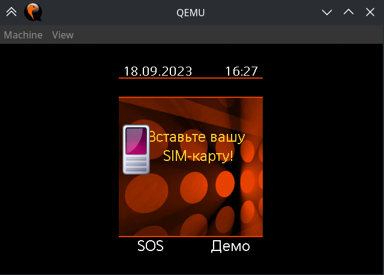

# What is this?

This is hardware emulator for any boards with pmb8875/pmb8876 CPU. Mostly legendary Siemens phones.

Current state is very poor alpha with many bugs and most of unimplemented hardware. :)

# Supported hardware
| Phone                    | CPU     | Emulator       |
|--------------------------|---------|----------------|
| BenQ-Siemens EL71        | pmb8876 | siemens-el71   |
| BenQ-Siemens CF130       | pmb8876 | siemens-el71   |
| BenQ-Siemens E71         | pmb8876 | siemens-e71    |
| BenQ-Siemens C81         | pmb8876 | siemens-c81    |
| BenQ-Siemens M81         | pmb8876 | siemens-m81    |
| Siemens S75              | pmb8876 | siemens-s75    |

# Prebuilded releases
For Windows you can download **pmb887x-emu-windows.zip** in releases: https://github.com/Azq2/pmb887x-emu/releases

Also, for windows required perl: https://strawberryperl.com/

For MacOS/Linux you must build itself. Unix way :)

# Building
Linux
```bash
# Install dependencies (Ubuntu or Debian)
sudo apt-get install perl
sudo apt-get build-dep qemu

# Clone from GIT
git clone https://github.com/Azq2/pmb887x-emu
cd pmb887x-emu
git submodule update --init

# Configure and build
./tools/build.sh
```

Windows (building on Ubuntu 23.04)
```bash
# Install dependencies
sudo apt-get -y install meson mingw-w64 mingw-w64-tools mingw-w64-i686-dev mingw-w64-x86-64-dev mingw-w64-common

# Clone from GIT
git clone https://github.com/Azq2/pmb887x-emu
cd pmb887x-emu
git submodule update --init

# Configure and build
./tools/build_win.sh
./tools/make_dist_win.sh # optional, for .zip with release
```

MacOS
```bash
# Install dependencies
brew install llvm libffi gettext glib pkg-config pixman ninja meson coreutils perl

# Clone from GIT
git clone https://github.com/Azq2/pmb887x-emu
cd pmb887x-emu
git submodule update --init

# Configure and build
./tools/build_osx.sh
./tools/make_dist_osx.sh # optional, for .tar.gz with release
```

# How to use

You can use simple frontend called `emu`. It provide more simple interface for qemu and written in perl.

Just `perl ./emu --help` for all options. But not all options works now :) 

Some useful examples:

1. Running fullflash with default emulator OTP
```
perl ./emu --fullflash EL71.bin --device siemens-el71
```
2. Running fullflash with your own ESN and IMEI
```
perl ./emu --fullflash EL71.bin --device siemens-el71  --siemens-esn=12345678 --siemens-imei=490154203237518
```
3. Seeing EXIT's in USART console:
 ```
 # First terminal
 perl ./emu --fullflash EL71.bin --device siemens-el71 --usartd

 # Second terminal
 perl bsp/tools/usartd.pl NormalMode
 ```

# Real world example

Let's assume you have fullflash. Of course, simple running commands from examples do not work :)

That's because Siemens mobile is paranoids and firmware has hardware binding.

And you have two ways:
1. Recalculate keys in firmware using following steps: [docs/recalc-siemens-fullflash.md](docs/recalc-siemens-fullflash.md)
   
   Then run emulator like this:
   ```
   perl ./emu --fullflash EL71.bin --device siemens-el71
   ```
2. Find original ESN and IMEI from your phone and run emulator like this:
   ```
   perl ./emu --fullflash EL71.bin --device siemens-el71  --siemens-esn=12345678 --siemens-imei=490154203237518
   ```

Once the emulator is running, you should first see BENQ-Siemens boot screen and then something like this:


Don't worry, that's okay. :)

Currently the emulator does not support SIM card emulation.

If you would like to get past the "Insert your SIM card" screen, you will also currently need to apply a patch like this one https://patches.kibab.com/patches/details.php5?id=7116 to your fullflash file. This can be done using V_Klay.

# Keyboard
You can press keys on the phone keyboard using your computer keyboard.
* Soft keys: Left: `F1`, Right: `F2`. Send/Start Call: `F3`. End Call: `F4`.
* Navigation (joystick): `Arrow keys`. Press navigation key: `Enter`.
* Number keys and `*` are mapped to NUM-keys. `#` is mapped to Numpad `/`.

Full key mapping is defined in [board.c](https://github.com/Azq2/qemu-pmb887x/blob/7c83c045a11cd110d220ec39a6cad3dbafe86e6c/hw/arm/pmb887x/boards.c#L19-L67).

# Status

Works:
- [x] Just running :D

Implemented hardware:
- [x] TPU timer
- [x] GPTU (partial)
- [x] DMA AMBA PL080
- [x] EBU
- [x] STM
- [x] PLL
- [x] DIF
- [x] NVIC
- [x] PCL (partial)
- [x] SCU (partial)
- [x] RTC (very partial)
- [x] USART
- [x] I2C in master mode (only pmb8876)
- [x] KEYPAD
- [x] LCD panels: JBT6K71 / SSD1286
- [x] PMIC: Dialog D1601XX (stub)

Not working, but planned:
- [ ] Synchronization with realword time. Currently clocks running on own "emulator" time.
- [ ] SDcard emulation (PL180)
- [ ] SIM emulatiom
- [ ] Power off, pickoff/keys sound
- [ ] Sound
- [ ] Fixing detection of DCA-510 cable for working USART in Siemens firmwares
- [ ] I2C for pmb8875

Not working and impossible:
- [ ] Bluetooth / IrDa
- [ ] USB

Not working and planned in far future:
- [ ] GSM / Internet emulation

Planned SGold2 boards:
- [ ] BenQ-Siemens SL75
- [ ] BenQ-Siemens S68
